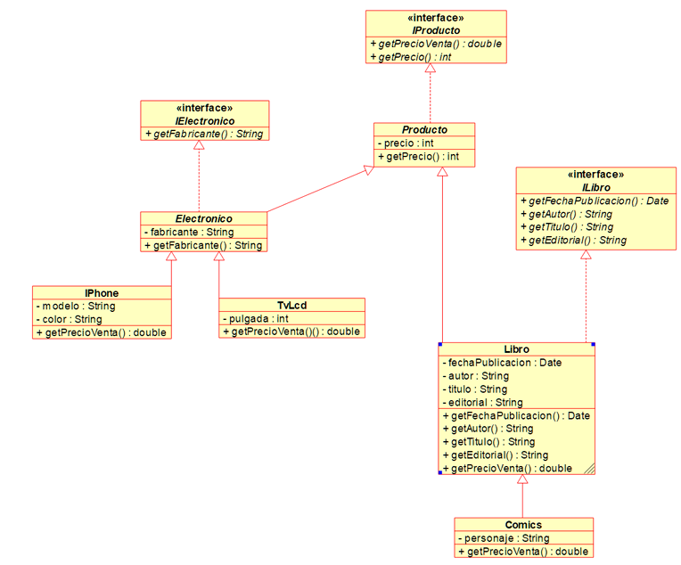

# Proyecto Catálogo de Productos  

Este proyecto demuestra el uso de **polimorfismo**, **clases abstractas** e **interfaces** en Java a través de un sistema de catálogo de productos.  

## Objetivo
Implementar una jerarquía de clases e interfaces que representen diferentes tipos de productos (electrónicos y libros), mostrando cómo múltiples clases concretas pueden compartir comportamientos comunes y especializarse según sus necesidades.

## Estructura del proyecto

### Interfaces
- **IProducto** → define `getPrecio()` y `getPrecioVenta()`.  
- **IElectronico** → define `getFabricante()`.  
- **ILibro** → define `getFechaPublicacion()`, `getAutor()`, `getTitulo()`, `getEditorial()`.

### Clases abstractas
- **Producto** → implementa `IProducto`, incluye atributo `precio`.  
- **Electronico** → implementa `IElectronico`, incluye atributo `fabricante`.  

### Clases concretas
- **IPhone** → hereda de `Electronico`, implementa `IProducto`.  
- **TvLcd** → hereda de `Electronico`, implementa `IProducto`.  
- **Libro** → hereda de `Producto`, implementa `ILibro`.  
- **Comics** → hereda de `Libro`, especialización con atributo `personaje`. 
### Diagrama UML de apoyo
 

## Ejemplo de uso (Main)
La clase `TestMain` crea instancias de diferentes productos y las almacena en un arreglo de tipo genérico `IProducto[]`.  
De esta manera, se demuestra el **polimorfismo** al tratar distintos productos bajo un mismo contrato (interface).  

```java
IProducto[] productos = new IProducto[5];
productos[0] = new IPhone(15000, "Apple", "Negro", "14 Pro Max");
productos[1] = new TvLcd(8000, "Samsung", 55);
productos[2] = new Libro(500, LocalDate.of(1967, 5, 30), "Gabriel García Márquez", "Cien Años de Soledad", "Sudamericana");
productos[3] = new Comics(300, LocalDate.of(1962, 8, 10), "Stan Lee", "Spider-Man", "Marvel", "Peter Parker");
productos[4] = new IPhone(12000, "Apple", "Blanco", "13 Mini");
```java
